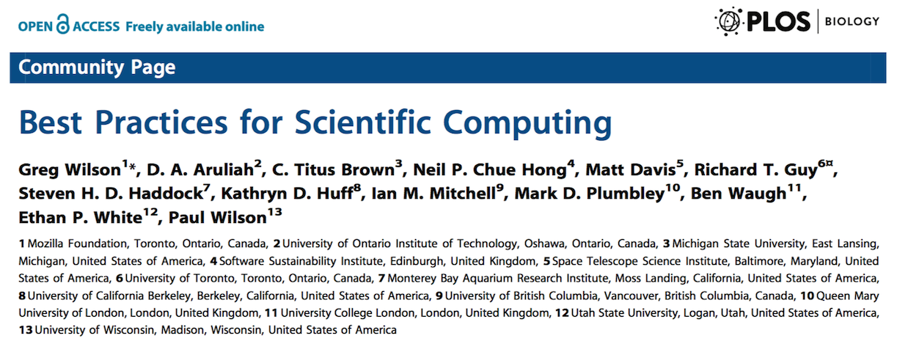
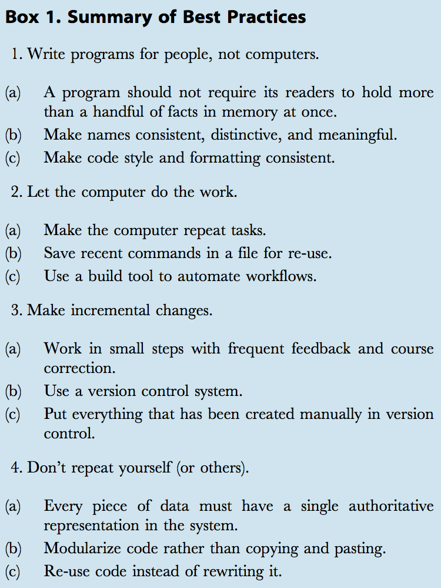
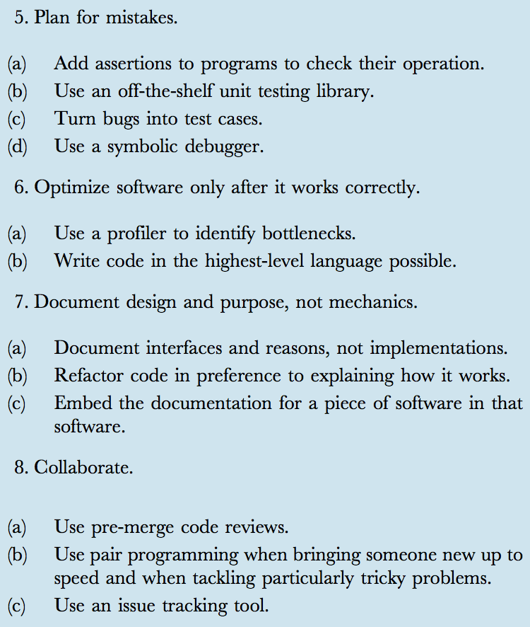
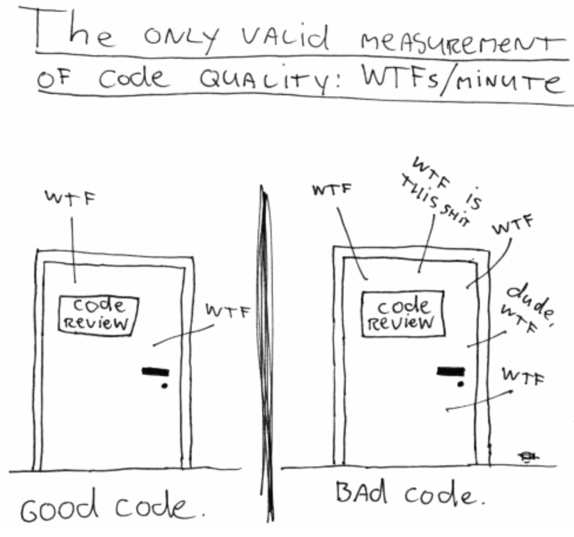

<style>
strong {color: #ff0000 !important;}
</style>

## statistical computing in **r**

20 May 2015

[_source_](https://github.com/raredd/trainr)

(html best viewed in chrome)

<div class="notes">

**Notes**  
- candy  
- usage  

</div>


## background

- Best practices for scientific computing, [PLoS biol, 2014](http://journals.plos.org/plosbiology/article?id=10.1371/journal.pbio.1001745)

<div align="center"></div>

<div class="columns-2"><font size=4>
**1** write programs for people, not computers  
**2** let the computer do the work  
**3** make incremental changes  
**4** don't repeat yourself (or others)  
**5** plan for mistakes  
**6** optimize only after it works correctly  
**7** document design/purpose, not mechanics  
**8** collaborate  

</font></div>

<!--

<div align="center" class="columns-2">


</div>

-->

## motivation

- computing has become the backbone of science

- nearly all scientific papers have theoretical modeling, data acquisition, cleaning, data analysis, figures and plots, p-values, etc
    - **every** result depends on computing 
    
- do computing well, but in your language

- if we do not do computing well, we [duke](http://www.nytimes.com/2011/07/08/health/research/08genes.html?_r=0)

- style and organization matter
    - coding for others
    - coding for (**future**) you

## motivation

<blockquote>
Our studies support the claim that knowledge of programming
plans and rules of programming discourse can have a _significant
impact on program comprehension_.<br /><br />
It is not merely a matter of aesthetics that programs
should be written in a particular style.<br /><br />
Rather there is a _psychological basis for writing programs
in a conventional manner_: programmers have strong
expectations that other programmers will follow these
discourse rules.<br /><br />
If the rules are violated, then the utility afforded by
the expectations that programmers have built up over time
is effectively nullified.
</blockquote>

<div class="credit" align="right"><small>[Soloway and Ehrlich, 1984](http://www.ics.uci.edu/~redmiles/inf233-FQ07/oldpapers/SollowayEhrlich.pdf)</small></div>

## un-motivation

- styling and organization can be very personal
    - ... and old habits die hard

- overhead of learning new things

- do what works best ~~for you~~

- regardless of preferences, have a coding style and follow it
    - be **_consistent_**

## **1** write code for (**other**) people, not computers

- clear, concise, **transparent** code

- our brains are designed to recognize patterns
    - with consistent patterns (style/formatting), only content remains

- comment copiously about **_what_** code does _not_ **how** it works

- naming things is hard: short, concise words; *verbs* for functions
    - don't use reserved words (function names, others: `?reserved`)

```{r, eval=FALSE}
fortunes::fortune('dog')
```

<blockquote>
Firstly, don't call your matrix 'matrix'. Would you call your dog 'dog'? Anyway,
it might clash with the function 'matrix'.
</blockquote>

<div class="credit" align="right"><small>Barry Rowlingson, R-help (October 2004)</small></div>

## **(1b)** styling and formatting

- style guides ([google](https://google-styleguide.googlecode.com/svn/trunk/Rguide.xml), [hadley](http://adv-r.had.co.nz/Style.html))

- indent lines **!**

- spacing around operators (`+`, `-`, `%in%`, `<-`, `,`)
    - improves readability, pinpoint mistakes

- any decent text editor (vim, sublime, emacs/ESS) or IDE (Rstudio) will do this for you

- 80 character width
    - scroll up **+** down, **not** left **+** right _and_ up **+** down
    - promotes good code and logic by avoiding wrapping long lines

## **(1c)** styling and formatting - example

```{r}
mylmfit=lm(mpg~wt+disp,mtcars)
summary=summary(mylmfit)
coefficients=summary$coefficients
coefficients=round(coefficients,digits=2)
estimates=coefficients[,1]
pvalues=coefficients[,4];pvalues
pvalues[1]="<0.01"
matrix=cbind(estimates,pvalues)
colnames(matrix)=c("Estimates","p-values")
as.data.frame(matrix)
```

## **(1d)** styling and formatting - example

```{r}
fit <- lm(mpg ~ wt + disp, data = mtcars)
summ <- summary(fit)$coefficients
summ <- round(summ, digits = 2)
cbind.data.frame(Estimate = summ[, 1],
                 `p-value` = format.pval(summ[, 4], eps = .01))
```

## **2** let the computer do the work

```{r, echo=FALSE}
f <- function(x, start = 5) {
  l <- seq(start, 1, length.out = length(x))
  paste0(sprintf('<font size=%spt>%s</font>', l, x), collapse = ', ')
}

x <- c('thinking about problem', 'writing code', 'errors', 'manipulating', 
       'road-blocks', 're-writing', 'higher priorities', 'tables and figures',
       'tweaking', 'writing words', 'adding analyses', 'removing observations',
       'etc')
```

- computer time is cheap; people time (and **frustration**) is expensive
    - number-crunching, run-time, simulations
    - `r f(x)`

- modularize code into reusable tools

- functions do **one** thing and do it well

- small, easy-to-understand pieces that can combine into something more complex

<br /><br />

<blockquote>
Divide each difficulty into many parts as is feasible and necessary to resolve it.
</blockquote>
<div class="credit" align="right"><small>Ren&eacute; Descartes</small></div>

## **(2b)** modularize code - example

```{r}
f1 <- function(...) {
  fit <- lm(mpg ~ wt + disp, data = mtcars)
  summ <- round(summary(fit)$coefficients, digits = 2)
  cbind.data.frame(Estimate = summ[, 1],
                   `p-value` = format.pval(summ[, 4], eps = .01))
}

f1()
f1(mpg ~ wt + disp + hp, digits = 3)
```

## **(2c)** modularize code - example

```{r}
f2 <- function(form, dat = mtcars, digits = 2) {
  fit <- lm(form, data = dat)
  summ <- round(summary(fit)$coefficients, digits = digits)
  cbind.data.frame(Estimate = summ[, 1],
                   `p-value` = format.pval(summ[, 4], eps = 10 ** -digits))
}

f2(mpg ~ wt + hp + factor(cyl), digits = 3)
```

## **3** make incremental changes

without version control:

- freeze the current state to create a daily working-copy
    - if unsatisfied, rollback to previous day (hour, week)
    
- for major changes, freeze current project and create a new directory

- organize data pulls by date
    - unlimited **_free_** storage (thanks, dana-farber)

with version control ([git](http://git-scm.com), [github](https://github.com)):

- for your packages: **yes**

- for collaboration: **yes**

- for analyses: **no**

## **4** don't repeat yourself

- write (and test) functions *once* and re-use
    - add frequently-used functons (or data) to a personal package

- repeating similar tasks in the same project
    - "Treatments included <font color="#3399FF">RCHOP (n = 10, 50%), R-CVP (n = 5, 30%), and RCHOEP (n = 4, 20%)</font>"
    - "Most common toxicities were <font color="#3399FF">anemia (n = 10, 50%), thrombocytopenia (n = 9, 45%), nuetropena (n = 7, 30%)</font>"
    - **mistakes, typos, and errors, oh my!**

- e.g., repeating similar tasks across multiple projects
    - plotting parameters to suit a particular journal
    - wrapper functions to save typing and mistakes

## **(4b)** don't repeat yourself - example

```{r, results='hold'}
print_counts <- function(x) {
  ## x a vector of character strings (or factors)
  ## usage: print_counts(letters[1:5])
  
  ## helper function: ipr
  ipr <- function(x) {
    ## tests
    ## ipr(1); ipr(1:2); ipr(1:5)
    if (length(x) == 1) x else
    if (length(x) == 2) paste(x, collapse = ' and ') else
      sprintf('%s, and %s', paste(x[-length(x)], collapse = ', '), tail(x, 1))
  }
  tt <- if (!is.table(x)) sort(table(x), decreasing = TRUE) else x
  ipr(sprintf('%s (n = %s, %s%%)', names(tt), tt, round(tt / sum(tt) * 100)))
}

table(tx <- rep(c('RCHOP','R-CVP','RCHOEP'), c(10, 6, 4)))
print_counts(tx)
```

## **(4c)** don't repeat yourself - example

- wrappers
    - set defaults for another function

```{r}
(x <- c(rnorm(4), NA))
sum(x)

sum2 <- function(...) sum(..., na.rm = TRUE)
sum2(x)
```

## **(4d)** don't repeat yourself - example

```{r, fig.height=4, fig.width=8}
my_plot <- function(...)
  plot(..., las = 1, bty = 'l', tcl = .2, xlab = 'Patient No.', ylab = '',
       pch = 19, col = 'dodgerblue2', cex = 1.5, family = 'HersheySerif')

par(mfrow = c(1, 2), mar = c(5, 3, .5, 1), bg = 'transparent')
my_plot(1:5, x)
my_plot(6:10, -x)
```

## **5** plan for mistakes

- record your work in **self-contained**, reproducible script(s)

- restart with a clean session at regular intervals
    - `source()` your code

- clean out anything you are no longer using or forgot to define
    - added benefit of having tested your code
    - **(**[knitr](http://yihui.name/knitr/) does this each time you compile**)**

- name scripts and analyses with **numbered**, descriptive words:
    - `00-get_data.R`
    - `01-munge_data.R`
    - `02-describe_data.R`
    - `03-fancy_models.R`
    - `99-appendix.R`
    - `99-1-appendix.R`
    - `99-2-appendix.R`
    - etc

## **6** optimization (a deviation)

- optimizing your time **&gt;&gt;&gt;** writing fastest, most-efficient code
    - cost of your time vs cost of computing time
    - e.g., `for` loops vs vectorization, `*apply`

- reproducibility: past, present

- automation: future

- `package`: everything in a workable environment

- most of the work should be data munging and exploration
    - i.e., error-checking
    - **do not** waste time on mundane, obnoxious tasks like ms word or excel
    - copy/pasting fewer than **_one_** time
    - automation of output - create dynamic documents ([knitr, sweave](http://yihui.name/knitr/))

## **7** document (everything)

- functions

```{r}
dmy <- function(d, m, y, origin = c(1, 1, 1900)) {
  ## parse day/month/year column data into standard date format
  ## examples:
    # dmy(NA, 5, 2005)
    # dmy(NA, 5, 13, origin = c(1, 1, 2000))
  ## arguments:
    # d, m, y: day, month, year as single integers, NAs, or vectors
    # origin: a vector of length three giving the origins for d, m, and y
  f <- function(a, b) {
    suppressWarnings(a <- as.numeric(a))
    ifelse(is.na(a), b, a)
  }
  y <- ifelse(nchar(y) <= 2, f(y, 0) + origin[3], f(y, 0))
  as.Date(sprintf('%04s-%02s-%02s', y, f(m, origin[2]), f(d, origin[1])))
}

dmy(NA, 5, 11:15, origin = c(15, 1, 2000))
```

## **(7b)** document (everything)

- functions in packages (with [roxygen2](https://github.com/yihui/roxygen2/blob/master/README.md))

```{r}
#' Date parse
#' 
#' Parse day/month/year column data into standard date format
#' 
#' For two-digit years, the origin year should be specified; otherwise, the
#' default of 1900 will be used. For NA year, month, or day, origin is used
#' for defaults, i.e., origin = c(15, 6, 2000) will convert missing days to
#' day 15, missing months to June, and missing years to 2000.
#' 
#' @param d,m,y day, month, year as single integers or vectors
#' @param origin vector of length 3 with origins for d, m, and y, respectively;
#' see details
#' 
#' @return A vector of \code{\link{Date}}-formatted strings.
#' 
#' @examples
#' dmy(25, 7, 87)
#' dmy(NA, NA, 2000:2005)
#' @export

dmy <- function(d, m, y, origin) {
  ## do stuff
}
```

## **(7c)** document (everything)

- data in packages (with [roxygen2](https://github.com/yihui/roxygen2/blob/master/README.md))

```{r, eval=FALSE}
#' Patient demographic data for protocol 15-000
#' 
#' Baseline demographic and lab results data for xx subjects enrolled on study.
#' 
#' @seealso \code{\link{trainr}}, \code{\link{tox}}, \code{\link{surv}}
#'
#' @format An object of class \code{data.frame} containing xx observations and
#' yy variables:
#' 
#' \tabular{rll}{
#' \tab \code{id} \tab patient unique id \cr
#' \tab \code{site} \tab enrollment site \cr
#' \tab \code{\dots} \tab ... \cr
#' \tab \code{wt} \tab weight (kg) \cr
#' \tab \code{ht} \tab height (cm) \cr
#' \tab \code{hgb} \tab hemoglobin (g/dL) \cr
#' \tab \code{\dots} \tab ... \cr
#' }
"demo"

?demo
summary(demo)
```

## **8** collaborate

- [github](https://github.com)
    - share, download/install packages (even if not on cran)
    - improve code; learn from others

- share useful code
    - fancy, pretty plots and graphics (or [games](https://github.com/raredd/fun/blob/master/README.md))
    - complex data cleaning ([regex](https://github.com/raredd/regex/blob/master/README.md))

- review code for others

## at the end of the day...

<div align="center"></div>

## resources

- general
    - [**the R Inferno**](http://www.burns-stat.com/documents/books/the-r-inferno/)
    - [advanced r [hadley]](http://adv-r.had.co.nz)
    - [Martin M&#228;chler, R-core, slides](http://www.r-project.org/nosvn/conferences/useR-2004/Keynotes/Maechler.pdf) + **youtube**
    
- intro to r
    - [**general coding (interactive)**](http://tryr.codeschool.com/)
    - [ucla stats](http://www.ats.ucla.edu/stat/r/seminars/intro.htm)
    - [(even) more slides](http://www.unomaha.edu/mahbubulmajumder/data-science/fall-2014/lectures/03-introduction-r/03-intro-r.html)

- r packages/knitr
    - [r packages book [hadley]](http://r-pkgs.had.co.nz)
    - [**how-to + code [hilary parker]**](http://hilaryparker.com/2014/04/29/writing-an-r-package-from-scratch/)
    - [knitr [yihui]](http://yihui.name/knitr/)
    
- version control
    - [git](https://www.atlassian.com/git/tutorials/)
    - [git/github in rstudio](http://r-pkgs.had.co.nz/git.html)
    
## resources

<iframe src="https://www.youtube.com/embed/ytbX-T1A8wE" frameborder="0" allowfullscreen></iframe>

## demo

putting these suggestions to practical use...


## specific tips

- learn to use [functionals](http://adv-r.had.co.nz/Functionals.html) well
    - take _functions_ as arguments, apply functions to the pieces
    - `lappy`, `tapply`, `aggregate`, `mapply`/`Map`, `Reduce`, `Filter`, etc

```{r}
## divide each column of a data frame by a different value of zz
zz <- 2:4
(out1 <- out2 <- out3 <- out4 <- data.frame(x = rep(4, 2), y = 9, z = 16))

## using a for loop is clumsy and litters the workspace with
## ii, the index, and any other variables created in the loop
for (ii in 1:3)
  out1[, ii] <- out1[, ii] / zz[ii]
out1
```

## **(b)** functionals

```{r}
## better, cleaner but still clumsy
out2[] <- lapply(1:3, function(ii) out2[, ii] / zz[ii])
out2

## even better
out3[] <- Map(`/`, out3, zz)
out3

## many other ways of getting the same result
as.data.frame(as.matrix(out4) / (col(out4) + 1))
```

## growing objects

```{r, cache=TRUE}
n <- 1e4

system.time({
  set.seed(1)
  out1 <- NULL
  for (ii in seq_len(n))
    out1 <- cbind(out1, rnorm(100))
})

system.time({
  set.seed(1)
  out2 <- matrix(NA, nrow = 100, ncol = n)
  for (ii in seq_len(n))
    out2[, ii] <- rnorm(100)
})
```

## `for` loops, functionals & vectorization

```{r}
system.time({
  set.seed(1)
  out3 <- sapply(seq_len(n), function(x) rnorm(100))
})

system.time({
  set.seed(1)
  out4 <- matrix(rnorm(100 * n), nrow = 100, ncol = n)
})

l <- list(out1, out2, out3, out4)
all(sapply(seq_along(l)[-1], function(x) identical(l[x - 1], l[x])))
```

## **Never** use ...

- `subset()`
    - non-standard evaluation
    - not intended for programmatic use
    - `$`, `[`, `[[` are faster and more powerful
    
## **(b)** `subset()`

```{r}
dd <- data.frame(a = 1, x = 1:5)
f1 <- function(...) {
  y <- 3
  ## do stuff
  subset(dd, ...)
}
f1(x > y)

## calculate y and use it to subset
y <- 1
f1(x > y)
```

## **(c)** `subset()`

<div class="columns-2">

```{r}
dd <- data.frame(a = 1, x = 1:5)
subset(dd, select = a:x)
subset(dd, select = -x)
```

```{r}
a <- b <- c('a','x')
subset(dd, select = b)
subset(dd, select = a)
```

</div>

## **(d)** `attach()`

- `subset()`
- `attach()`
    - side-effects, clutter environments
    - `detach` is used 110% less often than `attach`

```{r, eval=FALSE}
x <- 0
d1 <- data.frame(x = 1 , y = 2)
d2 <- data.frame(x = 2, y = 1)
attach(d1)
attach(d2)
search()
x
y
detach(d2)
y
x
rm(x)
x
rm(x)
detach(d1)
```

## **(e)** `setwd()`

- `subset()`
- `attach()`
- `setwd()`
    - use relative paths (avoid absolute paths)
    - re-organizing directories breaks absolute paths
    - opening a project or script in R automatically sets the working directory to the directory of that script
    
... just remove these words from your vocabulary

## **Do** use ...

- `TRUE` & `FALSE` **not** `T` & `F`

```{r, eval=FALSE}
(T <- rnorm(5))
TRUE <- 1
```

- `within()`
    - to refer to variables without indexing (`$`, `[`, `[[`) in a local environment
    - modify or create new variables in a data frame

```{r}
(dat <- within(mtcars, {
  gear <- factor(gear, levels = 3:5, labels = as.roman(3:5))
  wt <- wt * 1000
  disp <- drat <- qsec <- hp <- cyl <- NULL
}))[1:5, ]
```

## **(b)** `with()`

- `with()`
    - to refer to variables without indexing (`$`, `[`, `[[`) in a local environment

```{r, fig.width=4.5, fig.height=3, fig.align='center'}
par(bg = 'transparent', mar = c(3,4,2,2), las = 1)
with(dat[dat$mpg > 20, ], 
     barplot(tapply(wt, list(am, gear), mean), beside = TRUE,
             legend.text = c('auto','manual')))
```

## **(c)** `data=`, `str()`

- `data = `

```{r}
(fit <- lm(mpg ~ gear, data = dat))
```

- `str()`

```{r}
str(fit, list.len = 3, give.attr = FALSE)
```
